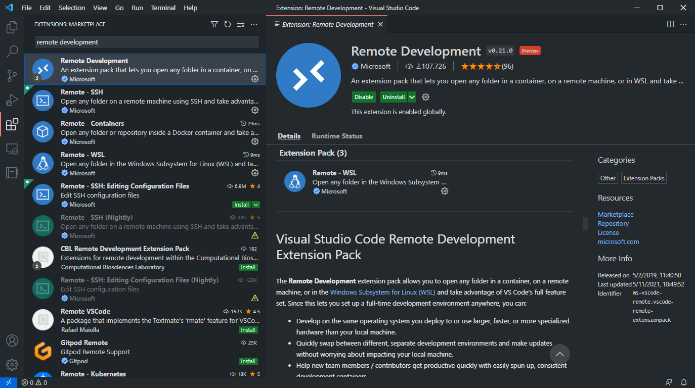
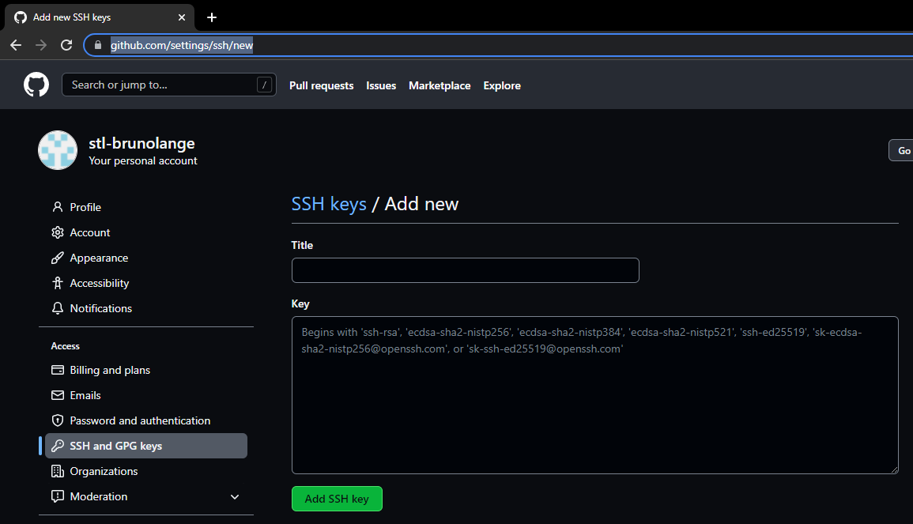
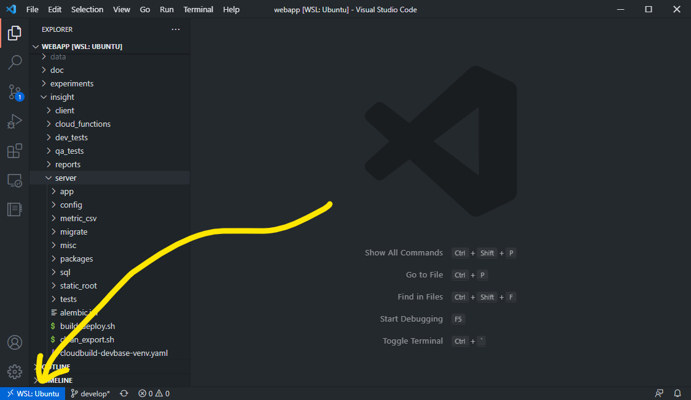

# How to setup a local development environment with Docker and VS Code

These notes will guide you through the steps required to set up a local development environment for
the Insight web app with Docker and VS Code as the IDE.

## Install WSL 2

We will use the Windows Subsystem for Linux (WSL 2) as the backend for Docker. It provides several
performance benefits over the Hyper-V VMs combined with LinuxKit alternative. You can find more
info [here](https://www.docker.com/blog/docker-hearts-wsl-2/).


Installing WSL 2 is as simple as opening up a PowerShell with administrative privileges and running
the command:

```powershell
wsl --install
```

### Cap memory usage for WSL 2

The Docker containers that host Insight Webapp can be very memory intensive. By default, WSL 2 will
use up resources from its host machine as they become available, so we recommend setting the limit
for how much memory WSL 2 is allowed to used.

In order to do so, create a file in your home directory called `.wslconfig`. In a PowerShell
prompt, run the following command

```powershell
notepad $env:userprofile\.wslconfig
```

and then paste the following contents into the file. You may change the actual values based on how
much memory your host machine has. A good rule-of-thumb is to provide WSL 2 with half of your RAM
and all the cores.

```ini
[wsl2]
memory=8GB
processors=4
swap=4GB
[network]
generateResolveConf = false
```

### [Optional] Install Windows terminal

Windows Terminal is a modern terminal application that supports multiple shells like Command
Prompt, PowerShell, and, notably, WSL. You can install it from the
[Windows Store](https://www.microsoft.com/en-us/p/windows-terminal/9n0dx20hk701).

WSL 2 should install Ubuntu 20.04 LTS by default. In the start menu, you can search for "Ubuntu"
or, if you've installed the Windows Terminal, it will appear as one of the options.


## Setup Docker

If you don't already have a Docker account, create one on https://www.docker.com/.

Next, install [Docker Desktop](https://www.docker.com/products/docker-desktop). Make sure that the
checkbox to install components for WSL 2 is selected.


Open up Docker Desktop and go to the settings. Make sure that Docker is in fact using WSL 2.


## VS Code

Download and install VScode. You'll also need the "Remote Development" plugin as it enables
mounting Docker containers directly into VS Code, granting a native-like development environment
(including the buit-in debuggers, testing framework, etc) even though the application sits behind
two layers of virtualization.




## Clone the `webapp` repo

### Setting up SSH keys

First things first, in order to clone the webapp repository you will need to authenticate yourself
to GitHub. This is done by placing SSH private and public keys inside the `~/.ssh` folder. The
public key needs to be sent to OPs so that they can configure GitHub to let it know that you're
you.

If you don't already have SSH keys, you can generate them with this simple command in an Ubuntu
terminal:

```terminal
ssh-keygen
```

Make sure to pick a strong passphrase to protect usage of your private key. The pair of private and
public keys should now be available inside the `~/.ssh` folder.

```terminal
$ ls -l ~/.ssh
-rw------- 1 bruno bruno 1896 Jan 18 17:21 id_rsa
-rw------- 1 bruno bruno  418 Jan 18 17:22 id_rsa.pub
```

If you already have SSH keys that you obtained some other way, just place them inside the `~/.ssh`
folder and make sure that both private (`id_rsa`) and public (`id_rsa.pub`) keys have their
permissions set to `600` (`ssh` refuses to work with key files that are too permissive).

```terminal
$ chmod 600 ~/.ssh/id_rsa*
```

Register your public SSH key in Github: https://github.com/settings/keys.




### Cloning the repo

Once you get confirmation from OPs that your public key has been registered in Github, you should
be able to clone the repo.

In an Ubuntu terminal, issue the following commands:

```terminal
mkdir -p ~/code
cd !$
git clone git@github.com:StreetLight-Data/webapp.git
```

Congratulations, you now have access to the Webapp codebase!

```terminal
cd ~/code/webapp
code .
```

On the bottom left corner, you'll see that VS Code has opened up a folder that lives within WSL 2.
This is great for developing applications in Windows within a real Linux environment, but we will
have to go one step further. We need VS Code to grant us access into `devbox`, the main Docker
container that hosts the Insight webapp.



## Setting up the docker containers

To setup VS Code to work with our Docker containers, we'll make use of `docker-compose`, an utility
that coordinates simultaneous usage of multiple containers. The description of each of our
containers is done with the aptly named `docker-compose.yml` configuration file.

At the root of the repo, create the `docker-compose.yml` file and paste the following contents into
it.

```yml
version: '2'

services:
  devbox:
    image: gcr.io/stl-webapp/devbox:latest
    ports:
      - "2201:22"    # SSH
      - "3000:3000"  # test dev server
      - "7000:7000"  # webapp npm server
      - "8000:8000"  # webapp python server
      - "9229:9229"  # node debug port
    volumes:
      - stl-home:/home/dev
      - ~/.ssh:/home/dev/.ssh
      - ~/code/webapp:/home/dev/code/webapp
    links:
      - db
      - dbtest
      - redis
    ulimits:
      nofile:
        soft: 65535
        hard: 65535
  db:
    image: gcr.io/stl-webapp/pgserver:latest
    ports:
      - "6543:6543"
    shm_size: 512mb
    volumes:
      - pgdata:/mnt/data/pgsql
  dbtest:
    image: gcr.io/stl-webapp/pgserver:unlogged
    ports:
      - "6542:6543"
    volumes:
      - pgdata_test:/mnt/data/pgsql
  redis:
    image: redis
    volumes:
      - redis_data:/data
  mvt:
    image: gcr.io/stl-webapp/mvt-server
    environment:
      - MVT_PORT=5001
      - MVT_LAYERGROUP_TTL=3600
      - DB_USER=webapp_ro
      - DB_PASS=webapp_ro
      - DB_HOST=db
      - DB_PORT=6543
      - DB_NAME=appdb
      - REDIS_HOST=redis_mvt
      - REDIS_PORT=6379
      - REDIS_DB=10
      - REDIS_CONFIG_DB=11
      - TEST_REDIS_HOST=redis_mvt
      - TEST_REDIS_PORT=6379
      - TEST_REDIS_DB=10
      - TEST_REDIS_CONFIG_DB=11
      - STATS_LOGGING=off
    command: mvt_server.js
    ports:
      - "8283:5001"
    links:
      - db
      - redis_mvt
  redis_mvt:
    image: redis
    volumes:
      - redis_mvt_data:/data
    ports:
      - "6379:6379"
  redis_omniscidb:
    image: redis
    volumes:
      - redis_omniscidb_data:/data
    ports:
      - 6381:6379
  omniscidb:
    image: omnisci/core-os-cpu
    volumes:
      - omniscidb_storage:/omnisci-storage
    ports:
      - "6273-6280:6273-6280"
volumes:
  stl-home:
    external: true
  pgdata: {}
  pg12data_test: {}
  pgdata_test: {}
  redis_data: {}
  redis_mvt_data: {}
  redis_omniscidb_data: {}
  nginx_ws_data: {}
  redis_ws_data: {}
  omniscidb_storage: {}
```

The `docker-compose.yml` file references the external named volume `stl-home` that we must create before starting
the containers.

```terminal
$ docker volume create --name=stl-home
stl-home
```

### Authenticate to our Google Cloud Platform project

Before we can bring the containers described in the `docker-compose.yml` file, we need to provide
GCP with our credentials so that we're allowed to download the container images from the project's
bucket.

The Google Cloud SDK provides a series of utility commands that we can use to interact with a GCP
bucket. In order to install the Google Cloud SDK, run the following commands in your Ubuntu shell:

```terminal
$ sudo apt-get install apt-transport-https ca-certificates gnupg
$ echo "deb [signed-by=/usr/share/keyrings/cloud.google.gpg] https://packages.cloud.google.com/apt cloud-sdk main" | sudo tee -a /etc/apt/sources.list.d/google-cloud-sdk.list
$ curl https://packages.cloud.google.com/apt/doc/apt-key.gpg | sudo apt-key --keyring /usr/share/keyrings/cloud.google.gpg add -
$ sudo apt-get update && sudo apt-get install google-cloud-sdk
```

Next, run the following command and follow the instructions to authenticate yourself.

```
$ gcloud auth login
```

Then, we must configure docker to work with GCP:

```
$ gcloud auth configure-docker
```

Finally, we can now download all the required images and bring up all of the containers at once
with the command:

```terminal
docker-compose up -d
```


## Access the devbox through VS Code

As we've seen when we first cloned the repository, invoking `code .` on the `webapp` folder from the
Ubuntu terminal will open the folder within WSL 2. Go ahead and repeat those steps.


```terminal
$ cd ~/code/webapp
$ code .
```

To take it one step further and get VS Code to operate within `devbox` instead, we need to configure
it so that it knows that the application is meant to be run from a container.

Pull up the VS Code command pallette with `Ctrl` + `Shift` + `P` and search for `Remote-Containers:
Add Development Container Configuration Files...`.


Once prompted, select `From docker-compose.yml`.


Finally, select `devbox`. You'll notice that, at the root of the repo, VS Code created a
`.devcontainer` folder that contains two files:
- `devcontainer.json`
- `docker-compose.yml`

We won't need to modify this internal `docker-compose.yml` but we'll have to change a few things
about `devcontainer.json`.

1. Set `"workspaceFolder"` to `"/home/dev/code/webapp"`.
2. Though not strictly necessary, it is highly recommened that you install the Python plugin for
VS Code.
You can request VS Code to install it automatically within the container by adding
`"ms-python.python"` to the list of extensions in `"extensions"`.
3. Set `"shutdown"` action to `"none"`. This will prevent VS Code from shutting down the
containers every time it is closed.
4. Set `"remoteUser"` to `"dev"`. This is the development user registered inside the `devbox`
image.
5. Finally, we'll edit the container's environment so that it can find the PostgreSQL binaries.
Add a new object called `"remoteEnv"`. In it, add two keys:
- `"PATH": "${containerEnv:PATH}:/usr/local/pgsql/bin"`
- "LD_LIBRARY_PATH": "/usr/local/pgsql/lib"


Now, to test out your configuration, close VS Code and reopen it from Ubuntu. This time, VS Code
should notice the `.devcontainer` and ask you whether you want to reopen the folder in the
container. Go ahead and accept.


Notice how the bottom left corner should now read "Dev Container: ...`.

## Build the client code

Under `~/code/webapp/insight/client`, run the following commands:

```terminal
./maybe_npm_i.sh
./build_dev.sh
```

## Setup the application database

The Insight Webapp database requires some seed data that we currently host in a Google Cloud
Platform (GCP) bucket. We'll need to download those files first.

### Download database dumps from our GCP bucket

Create a new folder at the root of the repositoryto host all the database data we'll need to seed
the database.

```terminal
$ mkdir ~/code/webapp/data
$ cd !$
```

Finally, download all the required dump files with the following `gsutil` command:

```terminal
$ gsutil -m cp -r -I . <<EOF
gs://stl-app-eng-test/data/webapp_us_reference_80.dmp
gs://stl-app-eng-test/data/webapp_reference_us_test_78_1.dmp
gs://stl-app-eng-test/data/usca_osm_roads_64b.dmp
gs://stl-app-eng-test/data/webapp_census_us_cbsa_geo_95.dmp
gs://stl-app-eng/data/webapp_us_reference_state2_v1.dmp
gs://stl-app-eng-test/data/webapp_reference_sfva_78_2.dmp
gs://stl-app-eng-test/data/dev_reference_zone_ca_da_v2.dmp
gs://stl-app-eng-test/data/dev_reference_zone_us_taz_v2.dmp
gs://stl-app-eng-test/data/dev_reference_zone_usca_grid_v2.dmp
gs://stl-app-eng-test/data/dev_reference_zone_us_blkgrp_v2.dmp
gs://stl-app-eng-test/data/dev_reference_zone_us_zip_v3.dmp
gs://stl-app-eng-test/data/dev_reference_zone_usca_osm_all_80_1.dmp
gs://stl-app-eng-test/data/webapp_reference_zone_us_tract_82_dev.dmp
gs://stl-app-eng-test/data/dev_reference_zone_usca_rail_v3.dmp
gs://stl-app-eng-test/data/webapp_reference_sandbox_subscription_region_v2.dmp
gs://stl-app-eng-test/data/dev_reference_zone_ca_subdivision_v1.dmp
gs://stl-app-eng-test/data/dev_reference_zone_ca_tract_v1.dmp
EOF
```

### Access the devbox through VS Code

We'll set up the database from within the `devbox` container. Luckily, VS Code provides an
integrated terminal that lets us interact with the mounted containers. Back on VS Code, hit `Ctrl` +
`backtick` to open a terminal.

You can run commands like `whoami` and `uname -a` to confirm that you're inside the `devbox`
container.


### Add a local configuration file

The local development environment is controlled by a dedicated configuration module that extends
and overrides some of the default configuration settings that are checked out to the repository.

Paste the following contents inside a new file in `~/code/webapp/insight/server/config/local.py`.

```python
from config.docker_compose import *

DOMAIN = "docker.streetlightdata.net"  # set this to your hostname

# Uncomment to use dataservices to run metrics (need to be on StreetLight's VPN).
# If you don't need to run metrics, you do not need these.
# DS_BASE = 'http://dsg-dev.streetlightdata.net:9000'
# DS_DBLINK = 'dsdbdev host=dsg-dev.streetlightdata.net port=6543 user=ds_ro password=ds_ro'

REFERENCE_DUMP_FOLDER = "/home/dev/code/webapp/data"
US_REFERENCE_DUMP_FILENAME = "webapp_us_reference_80.dmp"
REFERENCE_VERSION = "80"
OSM_UNSPLIT_DUMP_FILENAME = "usca_osm_roads_64b.dmp"
OSM_SPLIT_DUMP_FILENAME = "webapp_reference_sfva_78_2.dmp"

CANNED_ZONE_ZIP_DUMP_FILENAME = "dev_reference_zone_us_zip_v3.dmp"
CANNED_ZONE_BLKGRP_DUMP_FILENAME = "dev_reference_zone_us_blkgrp_v2.dmp"
CANNED_ZONE_TAZ_DUMP_FILENAME = "dev_reference_zone_us_taz_v2.dmp"
CANNED_ZONE_GRID_DUMP_FILENAME = "dev_reference_zone_usca_grid_v2.dmp"
CANNED_ZONE_DA_DUMP_FILENAME = "dev_reference_zone_ca_da_v2.dmp"
CANNED_ZONE_OSM_ALL_DUMP_FILENAME = "dev_reference_zone_usca_osm_all_80_1.dmp"
CANNED_ZONE_TRACT_DUMP_FILENAME = "webapp_reference_zone_us_tract_82_dev.dmp"
CANNED_ZONE_RAIL_DUMP_FILENAME = "dev_reference_zone_usca_rail_v3.dmp"
CANNED_ZONE_CA_TRACT_DUMP_FILENAME = "dev_reference_zone_ca_tract_v1.dmp"
CANNED_ZONE_CA_SUBDIVISION_DUMP_FILENAME = "dev_reference_zone_ca_subdivision_v1.dmp"

DISABLE_QLIK = True
DISABLE_UAF = True
GOOGLE_CLIENT_ID_OR_API_KEY = "client=gme-streetlightdatainc"

DEFAULT_QLIK_ENV = "viz-dev"

MVT_REDIS_HOST = "redis_mvt"
MVT_REDIS_PORT = 6379
MVT_REDIS_DB = 10
MVT_REDIS_MAP_CFG_TTL_HOURS = 1
MVT_REDIS_MAP_CFG_TTL = MVT_REDIS_MAP_CFG_TTL_HOURS * 3600  # seconds

MVT_SERVER_EXTERNAL_URL = "http://docker.streetlightdata.net:8283/tiles"

OMNISCIDB_REDIS_HOST = "redis_omniscidb"
```

### Setup the Python virtual environment

Next, we need to setup the Python virtual environment since a few commands that we'll run to
manipulate the database actually require Python.

Run the following commands from the `devbox` terminal in VS Code.

```terminal
dev@df329bb7d2f0 $ cd ~/code/webapp/insight/server
dev@df329bb7d2f0 $ sudo ./create_flask_venv.sh
dev@df329bb7d2f0 $ sudo /usr/local/webapp/flask/bin/python -m pip install -r requirements-dev.txt
```

### Create and populate the application database

Once the Python virtual environment is created, you can now run the following commands to create
and populate the database from the GCP dump files.

```terminal
dev@df329bb7d2f0 $ cd ~/code/webapp/insight/server
dev@df329bb7d2f0 $ ./manage.py database create
dev@df329bb7d2f0 $ ./manage.py database create_schema
dev@df329bb7d2f0 $ ./manage.py load_test_data dev
```

### Create and populate the test database

If you're planning on running the backend unit tests, you'll need a supporting test database.
Here's how to create it:

```terminal
dev@df329bb7d2f0 $ ./manage.py --config=config.testing database create
dev@df329bb7d2f0 $ pg_restore -U postgres -p 6543 -d appdb -h dbtest --no-privileges ~/code/webapp/data/webapp_reference_us_test_78_1.dmp
dev@df329bb7d2f0 $ ./manage.py --config=config.testing database create_schema
```

Give it a test run:

```terminal
$ ./test_unit.sh -s tests/test_models/test_org.py:OrgTestCase
```


## Run the app server

Finally, run the Flask server:

```terminal
$ ./manage.py run_server
 * Serving Flask app "app" (lazy loading)
 * Environment: production
   WARNING: This is a development server. Do not use it in a production deployment.
   Use a production WSGI server instead.
 * Debug mode: on
 * Running on all addresses.
   WARNING: This is a development server. Do not use it in a production deployment.
 * Running on http://192.168.16.9:8000/ (Press CTRL+C to quit)
 * Restarting with stat
 * Debugger is active!
 * Debugger PIN: 131-642-816
```

## Configure Git

To wrap things up, just make sure that Git is properly configured inside the devbox container so
that your commits are properly authored.

```terminal
$ git config --global user.name stl-<first.last>
$ git config --global user.email <first.last>@streetlightdata.com
```

----

## Appendix

### VS Code workspace config file

```json
{
    "files.trimTrailingWhitespace": true,
    "files.exclude": {
        "**/.git": true,
        "**/.svn": true,
        "**/.hg": true,
        "**/CVS": true,
        "**/.DS_Store": true,
        "**/Thumbs.db": true,
        "**/__pycache__": true,
        "**/.mypy_cache": true
    },
    "search.exclude": {
        "**/node_modules": true,
        "**/bower_components": true,
        "**/*.code-search": true,
        "data/": true,
        "experiments/": true,
        "insight/server/static_root": true,
        "insight/server/packages": true,
        "**/prod_build": true
    },
    "python.defaultInterpreterPath": "/usr/local/webapp/flask/bin/python",
    "python.analysis.typeCheckingMode": "basic",
    "python.formatting.provider": "black",
    "python.linting.enabled": false,
    "[python]": {
        "editor.formatOnSave": true
    }
}
```

### Using the built-in debugger

We can make use of VS Code's built-in debugger by describing how to start the Flask server inside a
new task in the `launch.json` file.

To create the `launch.json` file, click on the Debugger tab on the left menu and then on "create a
launch.json file".


Paste the following object inside the `configurations` object:

```json
{
    "name": "Insight server",
    "type": "python",
    "request": "launch",
    "program": "${workspaceFolder}/insight/server/manage.py",
    "args": [
        "run_server"
    ],
    "jinja": true
}
```

If you run into a `No module named manage` issue when starting the debugger, add the following line
to the `manage.py` script:


### MVT server configuration

From the devbox, run the following command to configure the MVT server:

```
$ echo MSET mvtConfig.dev.dbHost db mvtConfig.dev.dbName appdb | redis-cli -h redis_mvt -n 11
```
